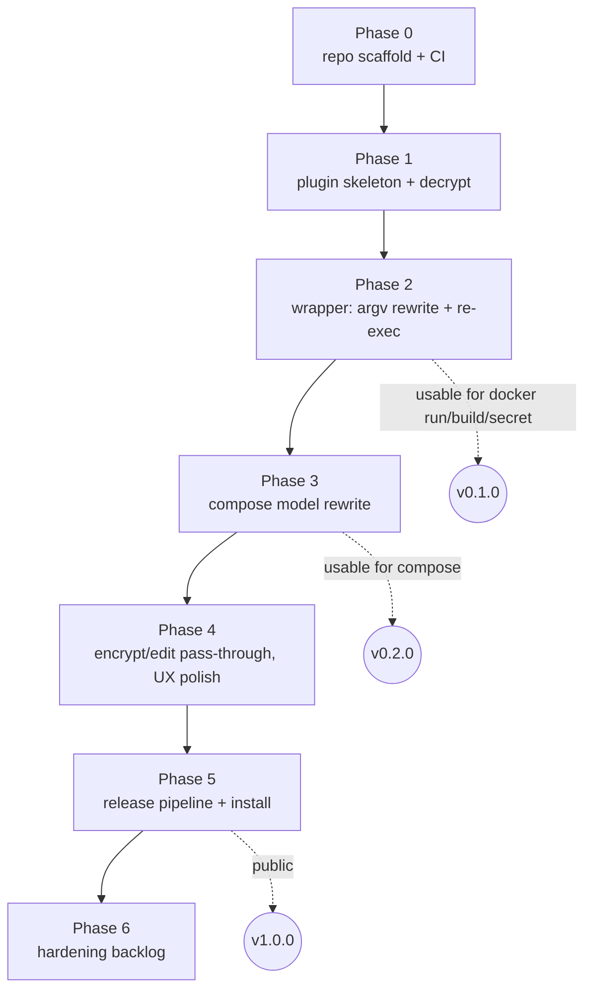

# `docker sops` — Development plan

Companion to [the design spec](../specs/2026-09-12-docker-sops-plugin-design.md).
Each phase ends in a tagged, releasable state. Phases 1–3 are the MVP; 4–6
make it a product.

## Toolchain (verified on this machine)

| Tool          | Version  | Role                                            |
|---------------|----------|-------------------------------------------------|
| Go            | 1.27.1   | implementation language                         |
| Docker CLI    | 29.8.0   | plugin host; Compose 5.5.1 available as plugin  |
| sops          | 3.13.3   | fixture creation, `encrypt`/`edit` pass-through |
| age / age-keygen | present | offline test keys                              |

Module: `github.com/mohsen0/docker-sops`. Key dependencies:
`github.com/docker/cli/cli-plugins/{plugin,metadata}`,
`github.com/getsops/sops/v3/decrypt`, `github.com/compose-spec/compose-go/v2`,
`github.com/spf13/cobra`.

## Phase map

## Phase 0 — Repository scaffold (½ day)

Deliverables:
- `go mod init`, `cmd/docker-sops/main.go` that only answers
  `docker-cli-plugin-metadata` and `version`.
- `Makefile`: `build`, `install` (copies to `~/.docker/cli-plugins/`),
  `test`, `lint`, `e2e`.
- `.golangci.yml`, `.gitignore`, `LICENSE` (Apache-2.0), README stub with
  the one-paragraph pitch, install one-liner and non-affiliation notice.
- GitHub Actions `ci.yml`: build, vet, lint, unit tests on Linux and macOS,
  plus a `go-licenses check` job with an allowlist (Apache-2.0, MIT, BSD,
  ISC, MPL-2.0).
- `docs/keychain.md`: per-OS guide for keeping the age key in macOS
  Keychain, Windows Credential Manager or Linux Secret Service via
  `SOPS_AGE_KEY_CMD`.
- `testdata/age-test-key.txt` plus a `make fixtures` target that
  (re)encrypts `testdata/plain/*` into `testdata/enc/*` with sops and that
  key. Fixtures are committed so tests never need the sops binary.

Exit criteria: `make install && docker sops version` prints the version and
`docker info` lists the plugin.

## Phase 1 — Plugin skeleton and `decrypt` (1 day)

Deliverables:
- `internal/sopsfile`: `IsEncrypted(path) (bool, error)`,
  `Detect(r io.Reader)`, `Format(path) string`, `Decrypt(path) ([]byte, error)`.
- `internal/tempstore`: `New(dir string) (*Store, error)`, `Put(basename, data) (path, error)`,
  `Close() error`. Enforces `0700`/`0600`, refuses to create under a
  world-writable parent unless it is the OS tempdir.
- `docker sops decrypt [-i] [-o FILE] FILE` command.
- Root command wiring with `plugin.Run`, `PersistentPreRunE`, `--quiet`,
  `--tmpdir`, `--pattern`, `--no-detect`, `--dry-run`.

Tests (write first): detection table across yaml/json/env/binary and
negative cases (plain files, files containing the word `sops`); format
inference; decrypt of every fixture equals its plaintext; tempstore
permissions and cleanup; `decrypt` command golden output.

Exit criteria: `docker sops decrypt testdata/enc/secrets.yaml` prints the
plaintext with `SOPS_AGE_KEY_FILE=testdata/age-test-key.txt`.

## Phase 2 — Wrapper mode for non-Compose commands (2 days)

Deliverables:
- `internal/argscan`: `Plan(argv []string, opts) (*Rewrite, error)` that
  returns the new argv plus the list of (source, decrypted) pairs; handles
  `--flag path`, `--flag=path`, `key=value,src=path` lists, bare paths, and
  the run/create/exec image cut-off.
- `internal/reexec`: `Run(ctx, argv, globalFlags) (exitCode int, err error)`
  using `DOCKER_CLI_PLUGIN_ORIGINAL_CLI_COMMAND`; signal forwarding; exit
  code mirroring.
- Root command fallthrough: any unknown subcommand becomes a wrapped docker
  command (`cobra` `DisableFlagParsing` on the wrapper so docker's own flags
  pass through).
- `--dry-run` prints the rewritten argv with temp paths redacted to
  `<decrypted:basename>` for stable test output.
- One-line stderr notice: `docker sops: decrypted 2 file(s)` unless `-q`.

Tests: argscan table tests (≥ 25 cases incl. edge cases: `=` in values,
`--` handling, non-existent paths, directories, symlinks, relative vs
absolute); reexec exit-code and signal tests with a fake `docker` script;
e2e on CI: `docker sops run --rm --env-file testdata/enc/app.env alpine env`
shows the plaintext value; `docker sops build --secret id=x,src=enc` with a
`RUN --mount=type=secret` Dockerfile; `docker sops secret create` against a
swarm-init'd daemon; assert temp dir is gone after each.

Exit criteria: tag `v0.1.0`. Works for `run`, `create`, `build`,
`buildx build`, `secret create`, `config create`, `stack deploy`.

## Phase 3 — Compose integration (2–3 days)

Spike (done 2026-09-12): Compose 5.5.1 bind-mounts `file:` secrets and
copies `environment:` secrets into the container. Decision recorded in spec
§3.4: encrypted secrets/configs become environment-sourced entries.

Deliverables:
- `internal/composefix`: `Load(flags ComposeFlags) (*types.Project, error)`;
  `Overrides(project, store) (yamlBytes, refs, error)`; override uses
  `!override` for `env_file` lists.
- `compose` subcommand: parses only the compose global flags it needs
  (`-f`, `--env-file`, `--profile`, `-p`, `--project-directory`), rewrites
  `--env-file` via argscan, generates the override, appends `-f`, re-execs.
- Handles `docker sops compose config` (useful for debugging) and all
  subcommands uniformly.
- Chosen solution for long-lived decrypted secrets from the spike.

Tests: override generation golden tests over sample projects (single
service, multiple env_files mixing plain and encrypted, secrets with `file`
and `external`, profiles, multiple `-f` with merge); e2e: `docker sops
compose up` with an encrypted `env_file` and an encrypted `file:` secret,
`exec` into the container to read `/run/secrets/<name>`, `down`, assert no
plaintext remains.

Exit criteria: tag `v0.2.0`.

## Phase 4 — Parity commands and UX polish (1 day)

- `encrypt`, `edit` pass-through to the `sops` binary (`DOCKER_SOPS_BIN`),
  forwarding all flags and the TTY.
- `docker sops decrypt` gains `--output-type` passthrough for format
  conversion.
- `docker sops key set|show|rm` backed by `zalando/go-keyring`; the decrypt
  path reads the stored identity when no sops age env var is set. Tested
  with the library's mock backend; manual check on each OS.
- Shell completion (`docker sops completion bash|zsh|fish`) — cobra gives
  this for free.
- Helpful errors: missing key → point at `SOPS_AGE_KEY_FILE` / `.sops.yaml`;
  wrapped command not found → list installed plugins.
- README: install, quick start, wrapper semantics, Compose section, env
  vars, comparison table with helm-secrets, security notes.
- `docs/keychain.md` (written in phase 0) updated to prefer `docker sops key`
  with the `SOPS_AGE_KEY_CMD` recipes kept as the manual alternative.

## Phase 5 — Release and distribution (1 day)

- GoReleaser: darwin/linux, amd64/arm64, static binaries named
  `docker-sops`, checksums, SBOM, cosign signatures.
- `THIRD_PARTY_LICENSES` generated by `go-licenses report` and bundled in
  every archive next to `LICENSE` and `NOTICE`.
- `install.sh` (curl-pipe) that detects OS/arch and drops the binary into
  `~/.docker/cli-plugins/`.
- Homebrew tap formula (`mohsen0/tap/docker-sops`) that symlinks the plugin.
- Release workflow on tag push; CI matrix adds the e2e suite.
- Tag `v1.0.0`.

## Status (2026-09-12)

Phases 0–5 are implemented on `main`: decrypt, wrapper mode (run, build,
secret, config, stack and any other command), Compose integration with
environment-sourced secrets, keychain key storage, encrypt/edit pass-through,
GoReleaser release pipeline, install script and Homebrew formula. Unit
coverage is 78–95% per package; e2e tests cover run, build, compose and
decrypt against a live daemon. Remaining before tagging v1.0.0: push, let CI
run on Linux, create the `mohsen0/homebrew-tap` repository and the
`HOMEBREW_TAP_GITHUB_TOKEN` secret, then tag.

## Phase 6 — Hardening backlog (as needed)

- fd-passing for env files (`--env-file /dev/fd/N`) to avoid disk entirely
  on Linux/macOS.
- Optional memory-backed tempdir (`/dev/shm`, `tmpfs`) when available.
- `docker sops exec-env FILE -- CMD` mirroring `sops exec-env`.
- Windows support (plugin discovery works; path/permission model differs).
- `vals` backend (cloud secret references) if demand appears; keep behind
  the `sopsfile` interface so it is a new package, not a rewrite.

## Risks

| Risk                                                     | Mitigation                                                                     |
|----------------------------------------------------------|--------------------------------------------------------------------------------|
| Binary size from linking sops (all KMS SDKs, ~60 MB)     | Acceptable for a CLI plugin (buildx is similar); `-ldflags=-s -w`, `-trimpath`.|
| False-positive path detection rewrites an unrelated arg  | Only existing regular files with sops metadata are touched; `--dry-run` shows it. |
| Compose semantics drift (`!override`, merge rules)       | Pin compose-go; golden tests; e2e against the installed Compose.               |
| Decrypted secret file must outlive the plugin (`up -d`)  | Phase 3 spike decides between env-injection and project-scoped store.          |
| sops library API churn                                   | Only `decrypt` (the one stable package) is imported.                           |

## Definition of done for v1.0.0

- All e2e scenarios green on Linux CI and manually on macOS/Docker Desktop.
- No plaintext on disk after any wrapped command exits, verified by test.
- README covers every command and flag; `--help` matches README.
- Installable via curl script and Homebrew.
