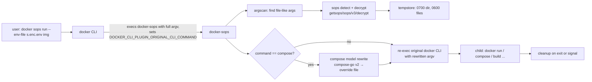

# `docker sops` — Design

**Status:** approved 2026-09-12
**Date:** 2026-09-12

## 1. Goal

A Docker CLI plugin, invoked as `docker sops ...`, that lets Docker commands
consume [sops](https://github.com/getsops/sops)-encrypted files without the
user decrypting them by hand. The model is
[helm-secrets](https://github.com/jkroepke/helm-secrets): keep secrets
encrypted in git, decrypt transparently at the moment a tool needs them, leave
no plaintext behind.

Non-goals for v1: a key-management UI, a secret backend other than sops,
Docker Engine (managed) plugins, and Windows support.

> Note on terminology. The page linked in the request
> (`docker plugin ...`) documents **Engine managed plugins** (volume, network
> and authz drivers installed with `docker plugin install`). What we are
> building is a **CLI plugin**: a `docker-sops` binary in
> `~/.docker/cli-plugins/` that the `docker` CLI discovers and execs, exactly
> like `docker-buildx` and `docker-compose`. The contract for those lives in
> the `docker/cli` repo under `cli-plugins/`.

## 2. User experience

### 2.1 Wrapper mode (the main feature)

Prefix any Docker command with `sops`. Every argument that is a path to a
sops-encrypted file is replaced with a decrypted copy for the duration of the
command. Plain files pass through untouched, so the wrapper is safe to use on
commands that mix encrypted and plain inputs.

```sh
docker sops run --env-file secrets.enc.env myimage
docker sops compose -f compose.yaml --env-file .env.enc up -d
docker sops build --secret id=npmrc,src=npmrc.enc .
docker sops secret create db_password db_password.enc
docker sops stack deploy -c stack.enc.yaml mystack
```

For `compose`, the plugin also looks *inside* the Compose model: `env_file:`
entries and `secrets.<name>.file:` / `configs.<name>.file:` entries that point
at encrypted files are redirected to decrypted copies through a generated
override file. The user's compose files are never modified.

### 2.2 Direct commands (helm-secrets parity)

```sh
docker sops decrypt secrets.enc.yaml           # plaintext to stdout
docker sops decrypt -i secrets.enc.yaml        # in place
docker sops decrypt -o out.yaml secrets.enc.yaml
docker sops encrypt secrets.yaml               # delegates to the sops binary
docker sops edit secrets.enc.yaml              # delegates to the sops binary
docker sops version
```

`encrypt` and `edit` are thin pass-throughs to a locally installed `sops`
binary (found on `PATH` or via `DOCKER_SOPS_BIN`). Decryption never requires
the `sops` binary.

### 2.3 Options and environment

| Flag                  | Env var                     | Meaning                                                |
|-----------------------|-----------------------------|--------------------------------------------------------|
| `--quiet`, `-q`       | `DOCKER_SOPS_QUIET`         | Suppress the one-line "decrypted N files" notice.      |
| `--tmpdir DIR`        | `DOCKER_SOPS_TMPDIR`        | Where decrypted copies live (default: private tempdir).|
| `--no-detect`         | `DOCKER_SOPS_NO_DETECT`     | Only treat files matching `--pattern` as encrypted.    |
| `--pattern GLOB`      | `DOCKER_SOPS_PATTERN`       | Extra name-based match, e.g. `*.enc.*` (repeatable).   |
| `--dry-run`           |                             | Print the rewritten command instead of running it.     |

### 2.4 Keychain-backed keys

`docker sops key set` reads an age private key from stdin or a file and stores
it in the OS credential store: macOS Keychain, Windows Credential Manager, or
the freedesktop Secret Service on Linux (GNOME Keyring, KWallet). When a key is
present there and neither `SOPS_AGE_KEY` nor `SOPS_AGE_KEY_FILE` is set, the
plugin exports `SOPS_AGE_KEY` to the decrypt call (in-process only; it is not
passed to the child docker process). `key show` prints the public key only;
`key show --private` prints the identity for backup. Implementation:
`github.com/zalando/go-keyring` (MIT). Until this lands, users can point
`SOPS_AGE_KEY_CMD` at their keychain CLI; `docs/keychain.md` documents the
per-OS commands.

Key material and key services are sops' concern: `SOPS_AGE_KEY_FILE`,
`SOPS_AGE_KEY`, AWS/GCP/Azure credentials, `SOPS_KMS_ARN`, PGP keyrings and
`.sops.yaml` all behave exactly as with the `sops` binary, because the plugin
links the same library.

## 3. Architecture



### 3.1 Packages

| Package              | Responsibility                                                                      | Depends on            |
|----------------------|-------------------------------------------------------------------------------------|-----------------------|
| `cmd/docker-sops`    | `main`; registers cobra commands via `plugin.Run`; emits plugin metadata.           | everything below      |
| `internal/sopsfile`  | Detect whether bytes/path are sops-encrypted; decrypt with format inference.        | `getsops/sops/v3/decrypt` |
| `internal/tempstore` | Create private temp dir, write decrypted files, remove on `Close()`.                | stdlib                |
| `internal/argscan`   | Walk argv, find path-bearing tokens (`--flag path`, `--flag=path`, `id=x,src=path`, bare paths), return rewrite plan. | `sopsfile` |
| `internal/composefix`| Load the Compose project with the same `-f`/`--env-file`/`--profile` flags, find encrypted `env_file` / `secrets` / `configs` refs, emit an override YAML. | `compose-go/v2`, `sopsfile`, `tempstore` |
| `internal/reexec`    | Locate the original `docker` binary, propagate global flags (`--context`, `--host`, ...), forward signals, mirror exit code. | stdlib |
| `internal/passthru`  | Run the local `sops` binary for `encrypt`/`edit`.                                   | stdlib                |

Each package is testable without Docker. Only `reexec` and the e2e suite need
a `docker` binary.

### 3.2 Detection

A file is considered sops-encrypted when its content carries sops metadata,
regardless of its name:

- YAML / JSON: a top-level `sops` mapping containing `mac`.
- dotenv: a `sops_mac=` line.
- binary (sops `--input-type binary`): the JSON wrapper form above.

Name-based matching (`--pattern`) is additive and exists for files that are
too large to sniff or for users who want explicitness. Detection reads at
most the first 1 MiB for YAML/JSON/dotenv sniffing.

Format for decryption is inferred from extension (`.yaml`/`.yml`, `.json`,
`.env`, `.ini`), falling back to content sniffing, then `binary`. The
decrypted copy keeps the original basename so tools that key on extension
(Compose, `--env-file`) keep working.

### 3.3 Argument rewriting (wrapper mode)

The scanner is deliberately dumb about Docker's flag grammar so it never has
to be kept in sync with Docker: it classifies tokens, not flags.

1. Split each token into candidate path fragments: whole token, the part
   after `=`, and `src=`/`source=` values inside comma-separated key/value
   lists (build `--secret`, `--mount`).
2. A fragment is a candidate if it is an existing regular file (relative to
   the CWD) and does not start with `-`.
3. If the candidate is sops-encrypted, decrypt it into the temp store and
   substitute the path in the token, preserving the token's shape.

Tokens that belong to the container's own command line are left alone: for
`run`, `create` and `exec`, scanning stops at the first positional argument
(the image or container name). For every other command the whole argv is
scanned, including anything after `--`.

### 3.4 Compose rewriting

`docker sops compose <flags> <subcommand> ...`:

1. Rewrite `--env-file` values (as in 3.3) so interpolation sees plaintext.
2. Load the project with `compose-go/v2` using the same `-f`, `--env-file`,
   `--profile`, `--project-directory`, `--project-name` values the user gave.
3. For every service `env_file` entry, and every top-level `secrets`/`configs`
   entry with `file:`, that resolves to an encrypted file: decrypt it into the
   temp store.
4. Emit an override YAML:
   - `services.<svc>.env_file: !override [<decrypted or original paths in the same order>]`
   - `secrets.<name>.file: <decrypted path>` (mapping merge, no tag needed)
   - `configs.<name>.file: <decrypted path>`
5. Append `-f <override>` to the argv and re-exec.

Secrets that use `environment:` or `external:` are untouched. Compose files
that are themselves encrypted (rare) are handled by 3.3 before this step.

Secrets and configs are handled differently from env files, because for
non-Swarm `up` Compose bind-mounts `file:` secrets, so a decrypted temp copy
would have to outlive the plugin. The spike (2026-09-12, Compose 5.5.1 on
Docker Desktop) confirmed that `file:` secrets are bind mounts while
`environment:` secrets are copied into the container with no mount. The
override therefore replaces each encrypted secret/config entry with an
environment-sourced one, tagged `!override` so the original `file:` key is
dropped:

```yaml
secrets:
  db_password: !override
    environment: DOCKER_SOPS_SECRET_db_password
```

The plaintext is added only to the environment of the child `docker compose`
process, so it never touches disk and does not depend on the temp store.
User-set `name`, `labels`, `driver`, `driver_opts` and `template_driver`
are carried over. Content containing NUL bytes or larger than 64 KiB falls
back to a decrypted temp file with a warning on stderr.

### 3.5 Re-exec and lifecycle

- The parent CLI path comes from `DOCKER_CLI_PLUGIN_ORIGINAL_CLI_COMMAND`
  (set by the docker CLI when it execs a plugin); fallback: `docker` on
  `PATH`.
- Global flags that precede `sops` in the original argv (`--context`,
  `--host`, `--config`, `--tls*`, `-D`) are replayed before the wrapped
  command.
- The child inherits stdin/stdout/stderr. `SIGINT`/`SIGTERM` are forwarded.
  The plugin exits with the child's exit code.
- Temp files: directory `0700`, files `0600`, created under
  `--tmpdir` / `$XDG_RUNTIME_DIR` / `os.TempDir()`. Removed in a `defer`
  and in the signal handler. Nothing decrypted is ever written next to the
  source file unless the user asked for it (`decrypt -i` / `-o`).

### 3.6 Plugin contract

- Binary `docker-sops`, installed to `~/.docker/cli-plugins/` (or
  `/usr/local/lib/docker/cli-plugins/`).
- `docker-sops docker-cli-plugin-metadata` returns
  `{"SchemaVersion":"0.1.0","Vendor":"mohsen0","Version":"<semver>","ShortDescription":"Use sops-encrypted files with docker commands","URL":"https://github.com/mohsen0/docker-sops"}`.
  This is provided by `github.com/docker/cli/cli-plugins/plugin.Run`.
- The root cobra command's `PersistentPreRunE` calls
  `plugin.PersistentPreRunE` so `--context` and friends are honoured.
- Hooks (`docker-cli-plugin-hooks`) are not used: they can only print
  "next steps" text after a command, they cannot rewrite one.

## 4. Error handling

| Situation                                        | Behaviour                                                              |
|--------------------------------------------------|------------------------------------------------------------------------|
| Encrypted file, no usable key                    | Fail before running docker; print sops' error and the file path.       |
| Candidate path is a directory / unreadable       | Not a candidate; pass through.                                         |
| Compose project fails to load                    | Fail with compose-go's error; suggest `docker compose config`.         |
| `encrypt`/`edit` with no `sops` binary           | Fail: "sops binary not found; install sops or set DOCKER_SOPS_BIN".   |
| Child docker exits non-zero                      | Mirror the exit code; temp files still removed.                        |
| Signal during child run                          | Forward, wait, clean up, exit with 128+signal.                         |

All messages go to stderr; stdout is reserved for the wrapped command and for
`decrypt` output.

## 5. Testing strategy

- **Unit** (no external binaries): `sopsfile` detection and format
  inference against committed fixtures; `argscan` token rewriting table
  tests; `composefix` override generation against sample projects;
  `tempstore` permissions and cleanup.
- **Fixtures**: an `age` test key is committed under `testdata/` and every
  encrypted fixture is encrypted to it. Decryption in tests sets
  `SOPS_AGE_KEY_FILE` to that key. No network, no cloud KMS.
- **E2E** (GitHub Actions, Linux): install the built plugin, run
  `docker sops run --env-file`, `docker sops compose config`, `docker sops
  build --secret`, assert plaintext reaches the container and no plaintext
  remains on disk afterward.
- **Dry-run** output is stable and used in e2e assertions.

## 6. Security notes

- Decrypted material is written only to a private temp directory and only
  for as long as the child process runs (Compose `up -d` caveat in 3.4).
- Decrypted values are never placed in argv (visible in `ps`). They enter
  the child's environment only for Compose secrets and configs, which
  Compose copies into the container without any mount.
- The plugin does not log file contents at any verbosity.
- Hardening backlog (post-v1): pass decrypted env files through inherited
  file descriptors (`--env-file /dev/fd/3`) so nothing touches disk.

## 7. Decisions and alternatives considered

| Decision                                    | Chosen                                       | Alternative rejected                                                  |
|---------------------------------------------|----------------------------------------------|-----------------------------------------------------------------------|
| Language                                    | Go                                           | POSIX shell (helm-secrets style): harder to test, can't link sops.    |
| Decrypt implementation                      | Link `getsops/sops/v3/decrypt`               | Shell out to `sops`: extra install step for every CI runner and user. |
| Encrypt/edit                                | Pass-through to `sops` binary                | Link internals: no stable API in sops for encryption; scope creep.    |
| Which files to touch                        | Content detection, plus optional glob        | Naming convention only: brittle, not "seamless".                      |
| Compose integration                         | Generated override `-f`                      | Rewriting user files in place: destructive; `secrets://` URIs: Docker has no protocol handler. |
| Docker integration                          | Wrapper re-exec                              | CLI hooks: can only print hints.                                      |
| Distribution                                | GoReleaser + GitHub Releases + Homebrew tap  | `docker plugin install`: that is the Engine plugin system, not CLI.   |
| License                                     | Apache-2.0                                   | MIT: equally compatible, but Apache matches Docker/Compose/SDKs and adds a patent grant. |

## 8. Licensing

The plugin is released under Apache-2.0. The dependency tree contains no
copyleft stronger than MPL-2.0 (sops, hashicorp/vault/api), which is
file-scoped and compatible with linking from Apache-2.0 code as long as any
modified MPL files are published under MPL. Releases ship a
`THIRD_PARTY_LICENSES` file generated by `go-licenses`, and CI fails if a
dependency introduces a forbidden license (GPL, AGPL, unknown).

The binary name `docker-sops` is required by the CLI plugin contract and is
descriptive use; the README states that the project is not affiliated with
Docker, Inc. or the sops project.
